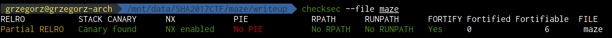
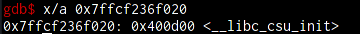
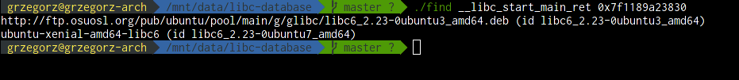
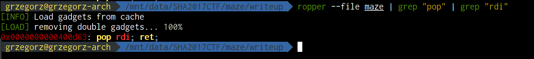
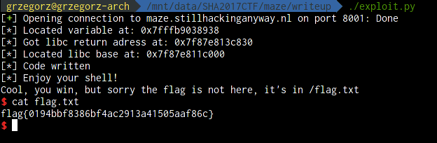

# SHA2017 CTF writeup
## Maze (300) - 9 solves

```
Can you escape the maze and find the SHA2017 CTF tent?
nc maze.stillhackinganyway.nl 8001
```

### Provided binary
The attached binary - `maze` is a 64 bit elf executable. After running `checksec` on it we get:

NX is enabled and `objdump` shows that the ret instruction in main is protected by a stack cookie. On the target system ASLR is enabled.

### Analysis
The analysis of the disassembly of the executable shows that the executable is a maze simulator. The maze is made up of rooms placed on a 32x32 square. Each room is numbered from 0 to 1023. In the .data section of the executable there is a table encoding the clear paths between the rooms. Each room contains a pseudo random ammount of `mate`.

We are prompted for commands in an infinite loop. The allowed commands are:
1. n - Move north (if the path is clear we substract 32 from the current room number)
2. s - Move south (if the path is clear we add 32 to the current room number)
3. w - Move west (if the path is clear we substract 1 from the current room number)
4. e - Move east (if the path is clear we add 1 to the current room number)
5. take X - Take exactly X `mate` from the current room if the room has enough `mate` in it
6. drop X - Leave exactly X `mate` in the current room if we have enough `mate`
7. help - display the avaliable commands
8. q - Exit the program

After executing each command the executable prints the current room number, the ammount of `mate` in the room and our current ammount of `mate` available for dropping.

 The executable starts in the room number 0 and to exit the main loop we need to go to the room with number 1023 and have exactly 31337 `mate` with us.

 ### The Bug
The flaw in the executable is that we do not check whether we are still in the maze or not. The analysis of the hardcoded table in the .data section shows that we can leave the maze and explore rooms with negative numbers and rooms with numbers greater than 1023. The table in which the amount of `mate` in the rooms is saved is located on the stack together with the amount of mate available to us, the current room number and other local variables.

The amount of `mate` in the rooms is written as a 16 bit signed integer. Thanks to the take and drop command we can manipulate the stack and as the program prints the amount of `mate` in the current room we can read the variables on the stack. During runtime we do not have access to the table containing the allowed moves so we can not explore every variable on the stack.

I first tried to overwrite the current room number so I could teleport to a room with a number greater than 1032 but because the current room number was stored at a negative offset with the respect to the `mate` table this failed. Because of it I analyzed the hardcoded table in the .data segment and obtained a sequence of moves that allows us to get to room 1023.

To write anything on the stack we need sufficient `mate` so because the amount of `mate` available was written on the stack as a signed 32 bit integer I have overwritten the 16 most significant bytes of this variable to get an practically infinite amount of mate. This allowed me to write anything on the stack.

Because of the small size of the binary and the lack of a syscall gadget in the binary we need to obtain some information about the location of the stack and shared libraries.

If we could get the location of the libc library and the stack during runtime the exploit would be straight forward. I first tried to locate the stack - analisis in `gdb` showed that in the rooms from -25 to -29 there is an address pointing to memory mapped to the stack. By dereferencing this address we get:

So the obtained address is probably a saved `rbp` value from the initialization of the binary so we can locate the stack based on it. Analisis showed that the variable containing the current room number is located at offset `2120` from the leaked pointer.

After locating the stack and obtaining an practically infinite `mate` we solve the maze and try to locate libc. After dumping variables from the stack I found the return address to libc. This address allowed me to use [libc_database](https://github.com/niklasb/libc-database) to determine the version of the libc running on the remote system.

I obtained two candidates.

### The Exploit
The binary contains a `pop rdi; ret;` gadget:

We have enough information to start a shell. After obtaining the stack and libc location and an practically infinite amount of `mate` we overwrite the main return address with our payload:
1. `pop rdi; ret;`
2. `Address of "/bin/sh" on the stack`
3. `Address of system() function in libc`
4.  `"/bin/sh"`

As we do not disturb the stack cookie - all we need to do after writing this payload to the stack is to exit the main loop. A simple `q` command is not enough as this command calls the exit() function. We need to win the game. Thanks to not checking whether the `mate` amount in a room overflows we simply issue a `drop` command in such a way that we got exactly 31337 of `mate` remaining. After going back to the room 1023 the rop chain is executed and we obtain a shell.

